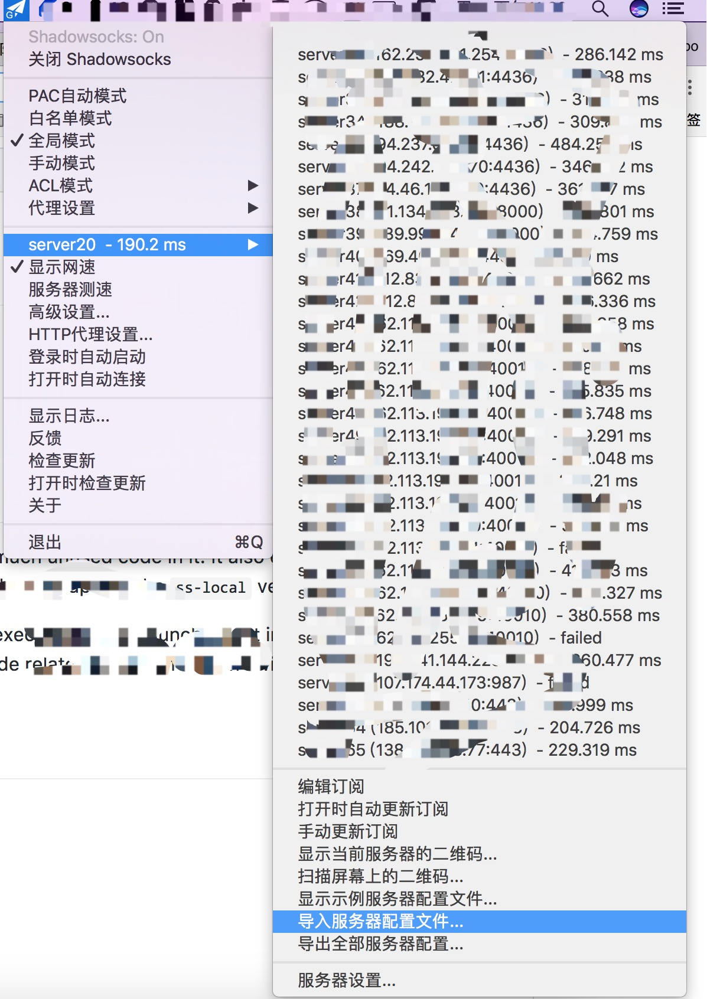

### ShadowSocks 爬虫

爬取 <https://free-ss.site/> 网站上更新的免费 SS 账号，将其中评分为 100 分的抓取出来写进 ss 配置文件中，然后通过 ss 客户端导入配置文件  

> 在线下载地址：  
> http://ss.phobal.cn

### 使用

需要 nodejs 环境，node 版本大于等于 v7.6.0, 因为代码中使用了 `async` `await` 语法, 步骤如下

* clone 项目

``` git
git clone https://github.com/phobal/ShadowSocksSpider.git
```

* 下载依赖

``` bash
npm i
```

* 运行

``` bash
node app.js
```

* 安装 SS 客户端

[shadowsocks下载地址](https://github.com/shadowsocks/ShadowsocksX-NG)

* 导入配置文件



选择通过上一步执行成功生成的 ss.json 文件并导入  
done!
接下来就可以愉快的玩耍了

> 部分账号大概每隔6小时变1次，重新输入最新的账号即可。另外部分账号的IP已经被墙，发现不能使用请换其他账号

### Change Logs

* `2017.11.07` 使用 [superagent](https://github.com/visionmedia/superagent) 请求源网站数据接口
* `2017.12.31` 使用 [puppeteer](https://github.com/GoogleChrome/puppeteer) 爬取源网站页面数据 

### 友情推荐

如果你不会或者不想配置各种复杂的环境，推荐一个性价比超级高、速度还不错的加速服务  

【推荐】[我们向往的](https://wmsxwd-a.men/auth/register?code=a6J1)

[地瓜游戏加速](https://www.diguass.cc/aff.php?aff=429)  

[墙裂](https://go.qianglie.cc/aff.php?aff=2189)  
